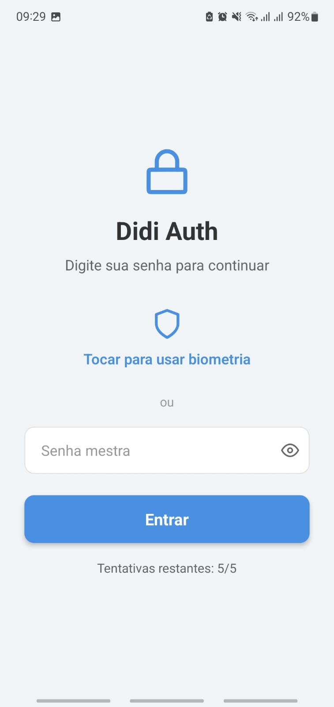
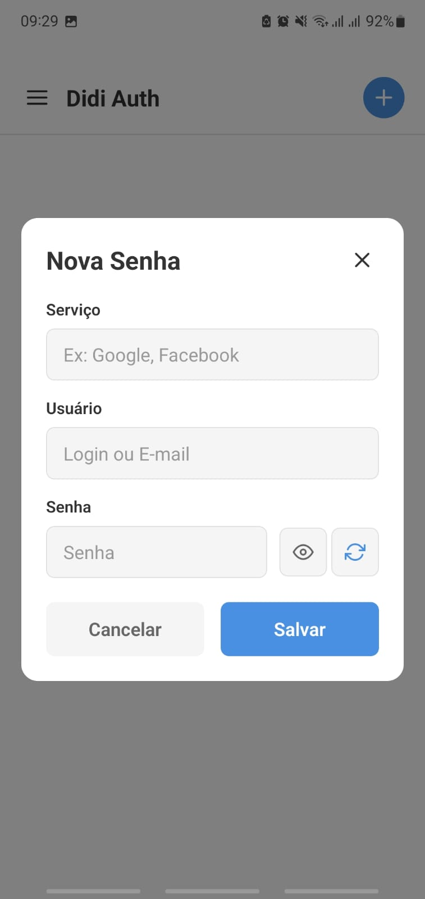
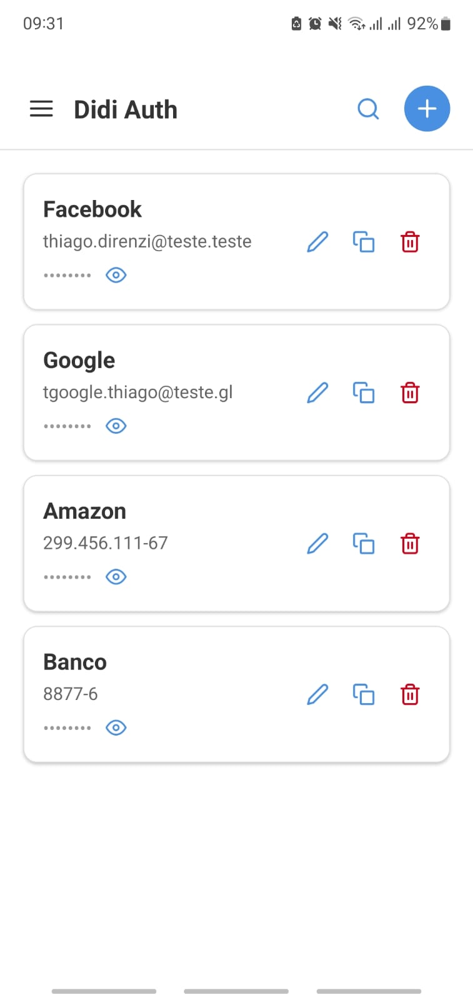
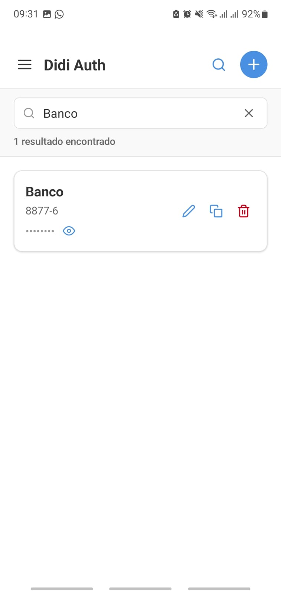
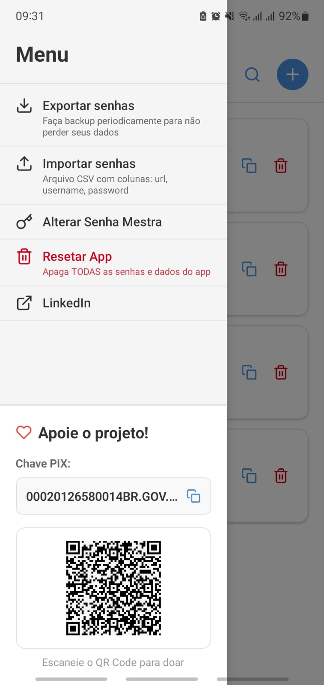

# Didi Auth - Gerenciador de Senhas Offline

Aplicativo Android para gerenciar senhas de forma segura, offline e 100% local.

---

## Download

**APK Atualizado:**  
[Baixar última versão](https://expo.dev/artifacts/eas/5iffdcAzisQZaAzP4Pdf22.apk)

**Versão:** 1.1.2

---

## Funcionalidades

- **Autenticação Biométrica** - Proteção com digital/face ID
- **Senha Mestra** - Camada adicional de segurança
- **Armazenamento Offline** - Dados salvos localmente no dispositivo
- **Gerador de Senhas** - Senhas fortes de 15 caracteres
- **Busca Inteligente** - Filtro por serviço ou usuário
- **Exportar/Importar** - Backup em CSV
- **Bloqueio Progressivo** - Proteção anti-brute force
- **Performance Otimizada** - Suporta milhares de senhas

## 📸 Demonstração

Abaixo estão algumas telas e um vídeo de apresentação do aplicativo:

### 🖼️ Telas do App

<p align="center">
  
  
  
  
  
  
  
</p>

### 🎥 Vídeo de Apresentação

https://github.com/Direnzii/didi-auth/blob/main/assets/images/video_apresentacao.mp4


## Início Rápido

### Desenvolvimento

```bash
# Instalar dependências
npm install

# Iniciar app
npm start

```

### Build para Produção

```bash
npx eas-cli build -p android --profile preview
```

### Atualizar App (OTA)

```bash
npx eas-cli update --branch production --message "Sua mensagem"
```

## Tecnologias

- **React Native** - Framework mobile
- **Expo** - Toolchain e build
- **TypeScript** - Type safety
- **AsyncStorage** - Persistência local
- **Expo Local Authentication** - Biometria
- **Expo Router** - Navegação

## Estrutura

```
app/                  # Telas principais
lib/
  ├── components/     # Componentes UI
  ├── hooks/          # Custom hooks
  ├── services/       # Camada de dados
  ├── utils/          # Funções utilitárias
  ├── types/          # TypeScript types
  └── constants/      # Configurações
```

## Segurança

- Hash SHA-256 para senha mestra
- Biometria nativa do dispositivo
- Dados isolados por aplicativo
- Bloqueio progressivo (5min → 5min → 20min → 5h)
- Sem conexão com internet

## Licença

MIT

## 🧡 Apoie o Projeto

Se este aplicativo te ajuda, considere apoiar o desenvolvimento e manutenção do **Didi Auth**.  
Seu apoio é fundamental para continuar aprimorando o app e mantendo-o 100% gratuito e offline.

### 💸 Doação via Pix

- **Chave Pix:** 00020126580014BR.GOV.BCB.PIX0136a2a321c7-8fac-4cb6-b231-7ff72af3d4505204000053039865802BR5922Thiago Direnzi Biazato6009SAO PAULO6214051093wwp64MGi63047382


